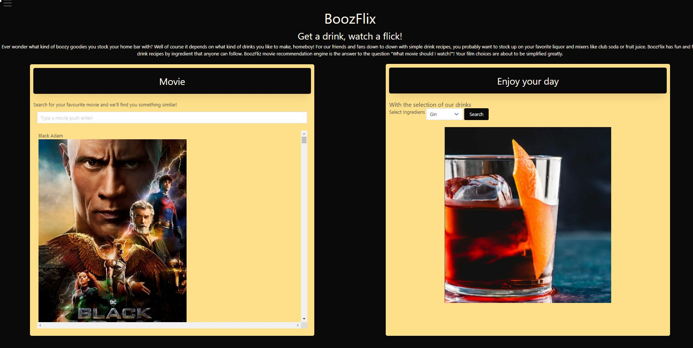

# PROJECT_1_BoozFlix

## Description

This interactive Front_End Application was created as the Project 1 at the conclusion of fundamental concept phase of the Coding Boot Camp. It includes front-end technologies and Third-party APIs.
The project is a collaborative work among a group of developers which solves a real-world problem.

This application provides a user with the opportunity to choose and prepare the drinks with the ingredient they choose at home.The user selects the ingredient from the dropdown menu and is presented with the list of drinks, then choosing particular drink user is presented with a receipe and image of the chosen drink

BoozFlix is also a movie reccomendation engine which can help to answer to the question "What movie should I watch?".
The movie selction can be made based on the keyword the user inputs. The user types in the keyword and is presented with the list of movies.

Application uses two server-side APIs Links to an external site: 1.https://www.thecocktaildb.com/api.php?ref=apilist.fun 2.https://developers.themoviedb.org/3/discover/movie-discover

Application uses client-side storage to store persistent data and send the receipes to the user's mail.

Application uses a CSS framework -Bulma which is a free, open source framework that provides ready-to-use frontend components that you can easily combine to build responsive web interfaces.
https://bulma.io/documentation/

Application is interactive (accepts and responds to user input).

## Installation

No installation is required for this app.

## Usage

The application is devided into two sections.
Movie Section:
When the user types in the keyword he want the selction to be made with,
Then he is presented with the list of movies which contain that keyword in the title.

Drinks Section:
When the user choose the ingredient from the dropdown menu,
Then he is presented with the list of drinks with receipes and the images.

[Project_1_BoozFlix] (https://felixbor.github.io/team-one-project-1/)

## Collaborators:

The project is a collaborative work among: 1.https://github.com/felixbor 2.https://github.com/ejhem 3.https://github.com/ZairaBarry

# License

This project is covered under the MIT license.

